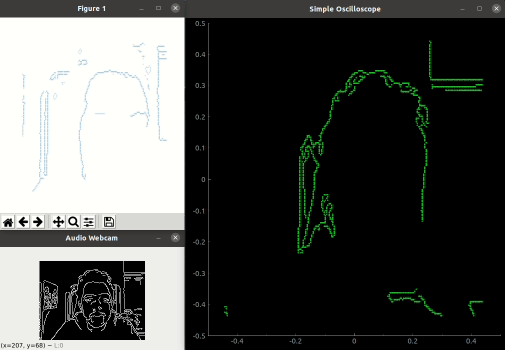
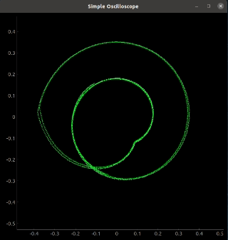

# osiloscope_visualizer

Running all scripts at the same time. Generating sound via processing webcam image and visualizing with two other scripts. If you liked this project also see [Woscope](https://m1el.github.io/woscope/). 

Running `osiloscope_pyqtgraph.py` while playing [Jerobeam Fenderson - Shrooms](https://www.youtube.com/watch?v=19jv0HM92kw) from Youtube.

Note: There many examples on Youtube but compression artifacts may make the visualization look terrible. Try this instead: https://m1el.github.io/woscope/?file=oscillofun.ogg

## Scripts

- `generate_using_webcam.py`: Processes webcam image and generates audio for visualization.
- `osiloscope_pyplot.py`: Super simple osiloscope python script.
- `osiloscope_pyqtgraph.py`: Faster and better visualizer.

## Dependencies

- Python = 3.8.10

- NumPy = 1.17.4
- Soundcard = 0.4.1
- Pyqtgraph = 0.12.3
- OpenCV = 4.5.4

